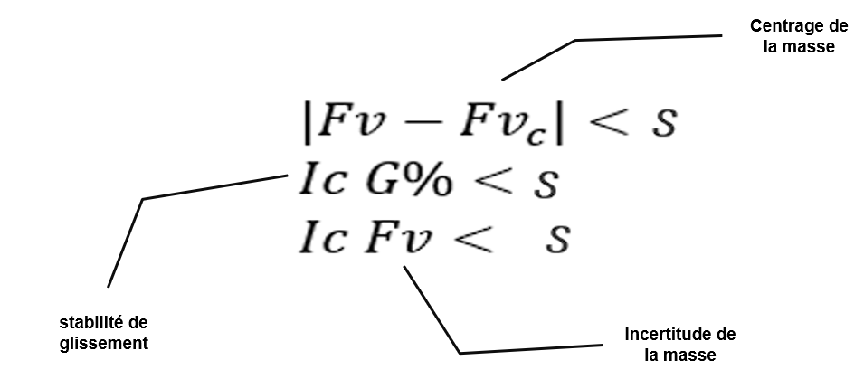
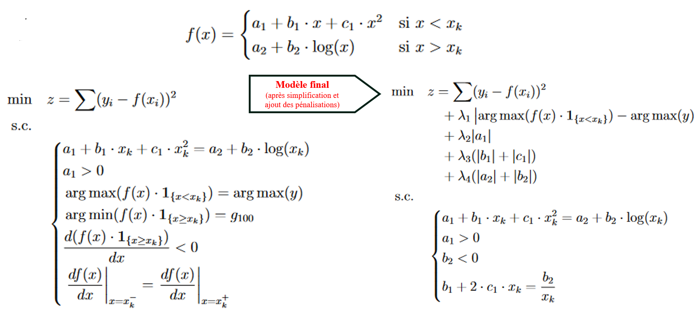
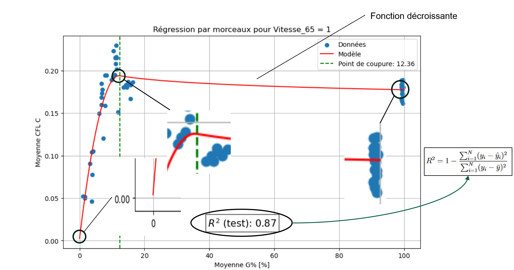

# Friction Modeling for Winter Runway Contaminants – A Decision Support Tool for the GRF Protocol

> This project addresses a **real-world machine learning problem** in aviation safety: estimating and exploiting the **Longitudinal Friction Coefficient (LFC)** on winter-contaminated runways. The work was conducted as part of a full-time internship, and is currently being transformed into a scientific publication.

---

## 🎯 Project Summary

The objective was to design and evaluate a **decision support tool** aligned with the **GRF protocol** (Global Reporting Format), an international standard used to communicate runway surface conditions to pilots.

From a machine learning perspective, the challenge is twofold:

- Develop **robust regression models** to predict LFC from sensor and environmental data under various winter contaminants (e.g., fresh snow, compacted snow, ice, slush).
- Build a **multi-class classifier** capable of identifying the type of contaminant based on LFC dynamics and associated variables.

The work emphasizes both **predictive performance** and **model interpretability**, in compliance with operational aviation requirements.

---

## 🧠 Key Machine Learning Tasks

### 1. Data Quality Pipeline

- Validated data consistency and physical plausibility of sensor variables.
- Designed **custom criteria** for stability and acceptance of observations.
- Performed **in-depth validation** of the target variable (LFC) in terms of **repeatability** and **reproducibility**.

#### 🔍 Stability Conditions of Sensor Variables

The figure below summarizes the thresholds used to filter out unstable or unreliable measurements based on sensor physics:

---

### 2. LFC Modeling per Contaminant

- For each of the 8 identified contaminants, built an independent model:
  - First using a **penalized piecewise linear regression under constraints**, for interpretability.
  - Then using **nonlinear ensemble methods** such as **XGBoost** and **Random Forest** to maximize accuracy.

#### ⚙️ Final Penalized Regression Model under Constraints

The constrained regression model was formulated as a custom nonlinear optimization problem, integrating both operational constraints and regularization terms:

#### 📈 Application Example – RMPC for N.C. (G)

The figure below shows the result of applying the constrained regression model to the contaminant type **N.C. (G)** (*Compacted Snow over Ice*).

- The model detects the cut-off point (green dashed line),
- It forces a decreasing behavior after the threshold (red segments),
- Achieves a strong fit on the test set with **R² = 0.87**.

---

### 3. Contaminant Classification

- Framed the inverse problem as a multi-class classification task.
- Trained models to predict the contaminant category from LFC and other variables.
- Analyzed feature importance to guide operational understanding.

---

## 🛠️ Tech Stack

- **Languages & Tools**: Python, Git
- **Core Libraries**: NumPy, Pandas, Scikit-learn, XGBoost, Matplotlib, Seaborn
- **Modeling**: Constrained regression (custom), tree-based models
- **Evaluation**: Cross-validation, metrics per contaminant, confusion matrices

---

## 📄 Documentation & Confidentiality

- ⚠️ **The dataset used in this project is confidential** and cannot be shared publicly due to regulatory and data protection constraints.
- 📘 **The full internship report** is available in this repository and is written in **French**.

---

## ✍️ Author

**Anass El Basraoui**  
Final-year student in Statistics & Data Science (ENSAI)  
Focused on applied machine learning, real-world modeling pipelines, and high-impact projects at the intersection of data and engineering.

---
